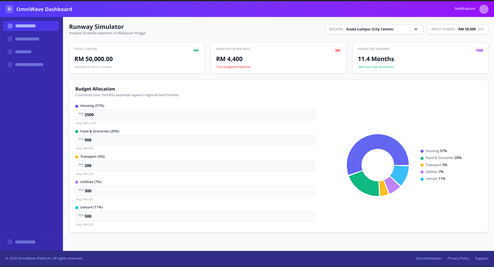

# Runway Simulator

Localized cost-of-living dashboard for Malaysia. Pick a region, set available funds,
tweak monthly budget allocations, and see projected runway update live.



## Features

- Region selector with per-region cost benchmarks (`src/util/costData.json`)
- Editable monthly budget per category (Housing, Food, Transport, Utilities, Leisure)
- Live-updating pie chart + legend showing budget allocation split
- Metrics cards: total capital, monthly burn rate, projected runway in months

## Tech Stack

- React 19 + Vite
- Tailwind CSS v4
- Recharts (pie chart)

## Setup

Requires Node.js.

```bash
# install dependencies
npm install

# start dev server
npm run dev
```

App runs at `http://localhost:5173` by default.

## Other Scripts

```bash
npm run build     # production build
npm run preview   # preview production build locally
npm run lint      # run ESLint
```
